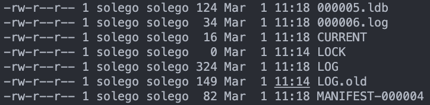

# 如何使用leveldb

1. 先安装必要的函数库

    ```shell
    mkdir -p build && cd build
    cmake -DCMAKE_BUILD_TYPE=Release .. && cmake --build .
    make install
    ```

2. 编译运行测试程序
    测试程序为 `/home/solego/leveldb/hello.cc`

    ```cpp
    // hello.cc
    
    #include <assert.h>
    #include <string.h>
    #include <leveldb/db.h>
    #include <iostream>
    
    int main(){
        leveldb::DB* db;
        leveldb::Options options;
        options.create_if_missing = true;
        // 打开一个数据库，不存在就创建
        leveldb::Status status = leveldb::DB::Open(options, "/tmp/testdb", &db);
        assert(status.ok());
    
        // 插入一个键值对
        status = db->Put(leveldb::WriteOptions(), "hello", "LevelDB");
        assert(status.ok());
    
        // 读取键值对
        std::string value;
        status = db->Get(leveldb::ReadOptions(), "hello", &value);
    
        assert(status.ok());
        std::cout << value << std::endl;
    
        delete db;
        return 0;
    }
    ```


​    进入到测试程序所在目录：

​    `cd /home/solego/leveldb`

​    编译链接：
​        `C++` 标准至少是 `C++11` ，需要链接 pthread 库：

​        `g++ hello.cc -o hello -L. -I./include -pthread -lleveldb -std=c++11`

​    运行：
​	    `./hello`

​		输出结果为：LevelDB

​		可以查看 `/tmp/testdb` 目录，其下所有文件如下图所示：

​		
